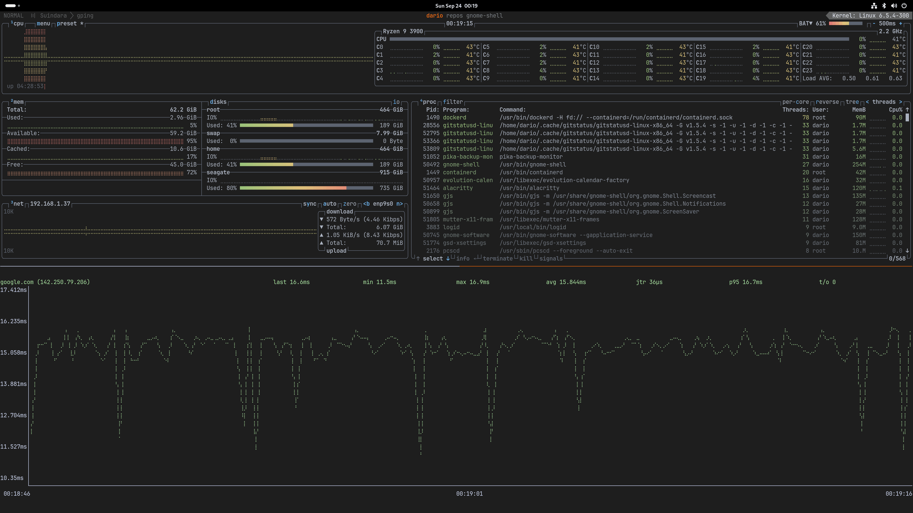

# GNOME Shell Extension - Quake Terminal




## Overview

The GNOME Shell Extension - Quake Terminal allows you to launch a terminal application in a Quake-style mode, which appears in fullscreen mode over any workspace. You can activate it with a simple keyboard shortcut. Additionally, it remains hidden in the overview mode to ensure it doesn't obstruct your vision when not in use.

---

## Installation

### Via GNOME Extensions Website

You can easily install the extension from the GNOME Extensions website:

[](https://extensions.gnome.org/extension/5808/snx-vpn-indicator)

### Manual Installation
If you prefer manual installation, follow these steps:

1. Clone this repository to your system:

```bash
git clone https://github.com/diegodario88/quake-terminal.git
```

2. Run the provided installation script:

```bash
./scripts/install.sh
```
